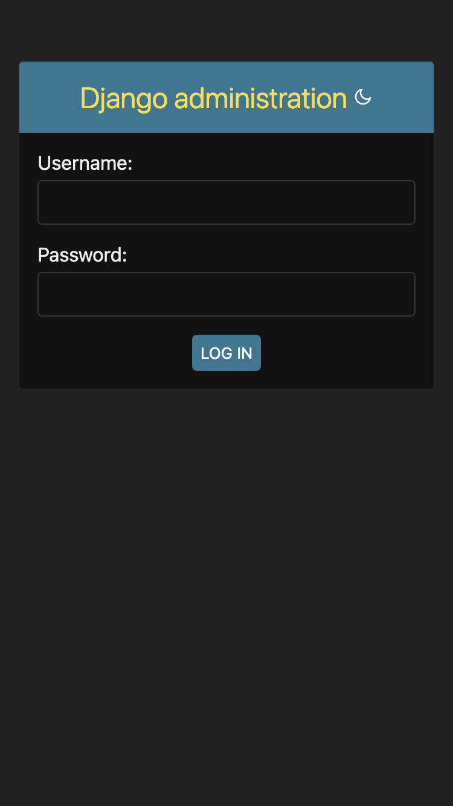
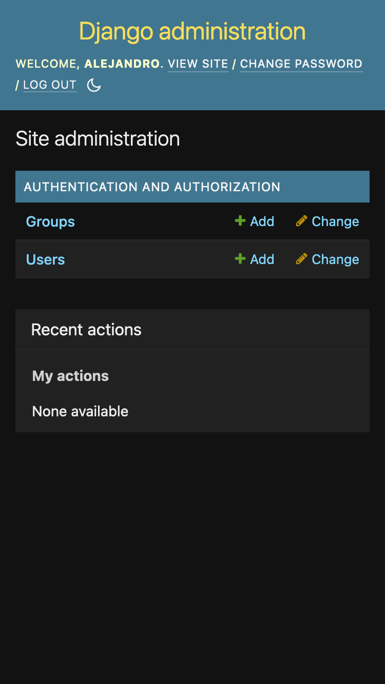

## Installation

1. **Clone the repository:**
```bash
git clone https://github.com/jalknToth/introDjango.git
```
2. **Run the setup script:**
```bash
chmod +x run.sh
./run.sh
```
3. **Create urls in persons app**

myapp/persons/urls.py:
```
from django.urls import path
from . import views

urlpatterns = [
    path('persons/', views.persons, name='persons'),
    path('persons/details/<int:id>', views.details, name='details'),

]
```
4. **Create urls in myapp**

myapp/myapp/urls.py:
```
from django.urls import path
from . import views

urlpatterns = [
    path('', views.main, name='main'),
    path('persons/', views.persons, name='persons'),
    path('persons/details/<int:id>', views.details, name='details'),
]
```
5. **Add the persons app in settings.py**

myapp/myapp/settings.py:
```
INSTALLED_APPS = [
    'django.contrib.admin',
    'django.contrib.auth',
    'django.contrib.contenttypes',
    'django.contrib.sessions',
    'django.contrib.messages',
    'django.contrib.staticfiles',
    'persons'
]
```
6. **Create models in persons app**

myapp/persons/models.py:
```
from django.db import models

class Person(models.Model):
    firstname = models.CharField(max_length=255)
    lastname = models.CharField(max_length=255)
    email = models.CharField(max_length=255)
    jobTitle = models.CharField(max_length=255)
```
7. **Create views in persons app**

myapp/persons/views.py:
```
from django.http import HttpResponse
from django.template import loader
from .models import Person

def persons(request):
    persons = Person.objects.all().values()
    template = loader.get_template('persons.html')
    context = {
        'persons': persons,
    }
    return HttpResponse(template.render(context, request))

def details(request, id):
    person = Person.objects.get(id=id)
    template = loader.get_template('details.html')
    context = {
        'person': person,
    }
    return HttpResponse(template.render(context, request))

def main(request):
    template = loader.get_template('main.html')
    return HttpResponse(template.render())

def testing(request):
    template = loader.get_template('template.html')
    context = {
        'fruits': ['Black', 'White', 'Yellow'],   
    }
    return HttpResponse(template.render(context, request))
```
8. **Add the model in the admin.py**
```
from django.contrib import admin
from .models import Person

class PersonAdmin(admin.ModelAdmin):
  list_display = ("firstname", "lastname", "jobTitle",)
  
admin.site.register(Person, PersonAdmin)
```

9. **Update the database**
```
cd myapp
python3 manage.py makemigrations persons
```
10. **Run the migrate command**
```
python3 manage.py migrate
```
11. **open a Python shell**
```
python3 manage.py shell
```
12. **Import Person class**
```
>>> from persons.models import Person
```
13. **Add a record to the table**
```
>>> person = Person(firstname='Write name', lastname='write surname', email='', jobTitle='')
>>> person.save()
```
14. **See if the Person table got a person**
```
>>> Person.objects.all().values()
```
15. **Add multiple records by making a list**
```
>>> person1 = Person(firstname='name1', lastname='surname1', email='', jobtitle='')
>>> person2 = Person(firstname='name2', lastname='surname2', email='', jobtitle='')
>>> person3 = Person(firstname='name3', lastname='surname3', email='', jobtitle='')
>>> person4 = Person(firstname='name4', lastname='surname4', email='', jobtitle='')
>>> person5 = Person(firstname='name5', lastname='surname5', email='', jobtitle='')
>>> persons_list = [person1, person2, person3, person4, person5]
>>> for x in persons_list:
>>>   x.save()
```

16. **Create the templates**

myapp/persons/templates/master.html
```
<!DOCTYPE html>
<html>
<head>
<title></title>
</head>
<body>




</body>
</html>
```
17. **Create Persons template**

myapp/persons/templates/persons.html:
```



  My app - List of all persons





  <p><a href="/">HOME</a></p>

  <h1>persons</h1>
  
  <ul>
    
      <li><a href="details/{{ x.id }}">{{ x.firstname }} {{ x.lastname }}</a></li>
    
  </ul>

```
18. **Create details template**

myapp/persons/template/details.html
```



Details about {{ person.firstname }} {{ person.lastname }}




<h1>{{ person.firstname }} {{ person.lastname }}</h1>

<p>Phone {{ person.phone }}</p>
<p>Job Title: {{ person.jobTitle }}</p>

<p>Back to <a href="/persons">Persons</a></p>


```
19. **Create main template**

myapp/persons/template/main.html:
```



My app




<h1>My app</h1>

<h3>Persons</h3>

<p>Check out all our <a href="persons/">persons</a></p>


```
20. **Create 404 error**
```
<!DOCTYPE html>
<html>
<title>Wrong address</title>
<body>

<h1>Ooops!</h1>

<h2>I cannot find the file you requested!</h2>

</body>
</html>
```
21. **Change this lines in settings.py**
```
DEBUG = False

ALLOWED_HOSTS = ['*']
```
22. **Create an User**
```
python3 manage.py createsuperuser
```
23. **Run the server**
```
python3 manage.py runserver
```
24. open 127.0.0.1:8000/admin/
<table>
  <tr>
    <td></td>
    <td></td>
  </tr>
</table>

